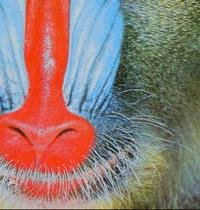

# pyimager 

 [](https://codecov.io/gh/UBC-MDS/pyimager) 

[](https://pyimager.readthedocs.io/en/latest/?badge=latest)

The pyimager package contains functions that aid in image manipulation and processing.

This package was developed as a project for DSCI-524.

## Creators

| Name | GitHub |
|---|---|
| Keanna Knebel| [Keanna-K](https://github.com/Keanna-K) |
| Mohammed Salama | [dataubc](https://github.com/dataubc) |
| Zhengyang (Zoe) Pan | [zoepan00](https://github.com/zoepan00) |
| Haoyu (Clara) Su | [clsu22](https://github.com/clsu22) |

To contribute to this project, you must adhere to the terms outlined in our [Code of Conduct.](https://github.com/UBC-MDS/pyimager/blob/master/CONDUCT.md)

## Overview:

Want to edit an image in the shell instead of GUI applications? `pyimager` is a python package that provides a quick and easy way to do some simple image processing and graphic editing. Based on the main needs of graphic editing, the package integrates four functionalities. The functionalities include: reducing the size of an image, cropping an image into a circle, reducing the number of colours in an image, and applying cool filter effects. By inputing the path of the image, users can run any of these functions with one line of code to get the desired image.  

## Installation:

In your console, type:

```
pip install -i https://test.pypi.org/simple/ pyimager
```

## Dependencies:
- Python 3.7 or greater
    - numpy = "^1.18.1"
    - Pillow = "^7.0.0"
    - scipy = "^1.4.1"
    - matplotlib = "^3.2.0"

## Functions:

- `circropper`: This function crops the input image into a circle. This can be useful when you want to make icons from images. 
- `redusize`: This function reduces the dimension of a given image by removing first columns and/or rows of the image according to the desired new width/height, as in the example below.
- `imgfilter`: This function applies a filter to a given image, altering the visual aesthetic. This includes options to blur and sharpen the image with varying degrees of strength. This filter effect is achieved through the application of a matrix convolution with the filter kernel and original image.  
- `reducolor`: This function reduces the image colors to get the cartoonized color effect. This can be either selected two colors images or eight colors images. 

## Usage Examples 

We will use `mandrill.jpg` saved in the `images` folder of this repository for the examples.


### `circropper(input_path, margin, output_path=None)` 
```python
from pyimager import pyimager

pyimager.circropper(input_path='images/mandrill.jpg', margin=0, output_path='images/mandrill_circropper.png')
```


### `imgfilter(input_path, filter_type, strength, output_path=None)`
```python
from pyimager import pyimager

pyimager.imgfilter(input_path="images/mandrill.jpg", filter_type="blur", strength=0.4, output_path="images/mandrill_blur.png")
```


```python
from pyimager import pyimager

pyimager.imgfilter(input_path="images/mandrill.jpg", filter_type="sharpen", strength=0.2, output_path="images/mandrill_sharpen.png")
```


### `reducolor(input_path, style, output_path=None)`  

```python
from pyimager import pyimager
#style 0, reduce the image color to white and black and save the new image mandrill_reducolor0.jpg in the images folder
pyimager.reducolor(input_path='images/mandrill.jpg', style=['black', 'white'], output_path='images/mandrill_reducolor0.jpg')
```


```python
#style 1, reduce the image color to 8 colors and save the new image mandrill_reducolor1.jpg in the images folder
pyimager.reducolor(input_path='images/mandrill.jpg', style=['eight'], output_path='images/mandrill_reducolor1.jpg')
```


### `redusize(input_file, output_file, new_height, new_width)`

```python
from pyimager import pyimager
# reduce the size from width 298 and height 298 to width 201 height 201
pyimager.redusize("images/mandrill.jpg", "images/reduced_mandrill.jpg", 201, 200)
```


## Documentation
The official documentation is hosted on Read the Docs: <https://pyimager.readthedocs.io/en/latest/>  

## Package in R

We have a package with the same functionalities in R : `rimager`. See [here](https://github.com/UBC-MDS/rimager)  

## Our package in python ecosystem:

There are existing packages to process images. For example `scikit-image`[here](https://scikit-image.org/docs/stable/auto_examples/), `PIL`[here](https://pillow.readthedocs.io/en/stable/handbook/index.html) are popular packages that can be used to resize, cut images and apply filters. The goal of this package is either to utilize packages like `matplotlib`, `PIL` to improve the pre-existing functions or to re-implement code manually with `numpy`. Also it automates the image editing process, producing the altered image by one line of code.

### Credits
This package was created with Cookiecutter and the UBC-MDS/cookiecutter-ubc-mds project template, modified from the [pyOpenSci/cookiecutter-pyopensci](https://github.com/pyOpenSci/cookiecutter-pyopensci) project template and the [audreyr/cookiecutter-pypackage](https://github.com/audreyr/cookiecutter-pypackage).
